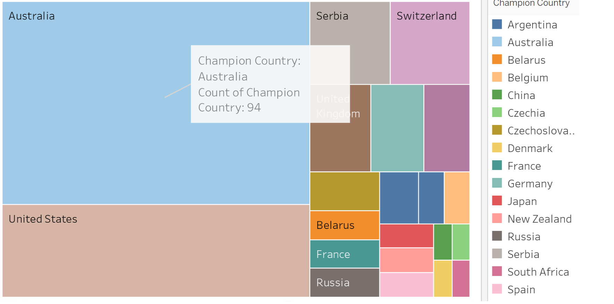

# Australian Open Tennis Analysis (1905–2023)

This project analyzes over a century of Australian Open tennis data, focusing on winners, nationalities, and match statistics.  
The aim is to identify high-level trends and highlight the dominance of certain champion countries and players.

## Key Features
- Analysis of all Australian Open champions from 1905 to 2023.
- Focus on top winners (5 or more titles).
- Visualizations built in Tableau and Excel to explore:
  - Country-wise distribution of champions
  - Historical trends across decades
  - Geographic spread of winners
  - Player dominance and era comparisons

## Visualization Example
Below is a treemap visualization of champions by country.  
Australia and the United States dominate the chart, followed by Switzerland, Serbia, and others.

## Tools Used
- **Excel** – Data cleaning and preparation  
- **Tableau** – Data visualization and storytelling  

## Purpose
The report and dashboard are designed for tennis fans and analysts interested in exploring historical trends of the Australian Open.

---
📊 *Explore the data, discover trends, and gain insights into one of the most prestigious tournaments in tennis history!*
